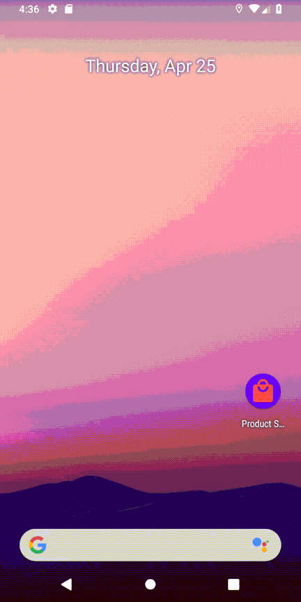
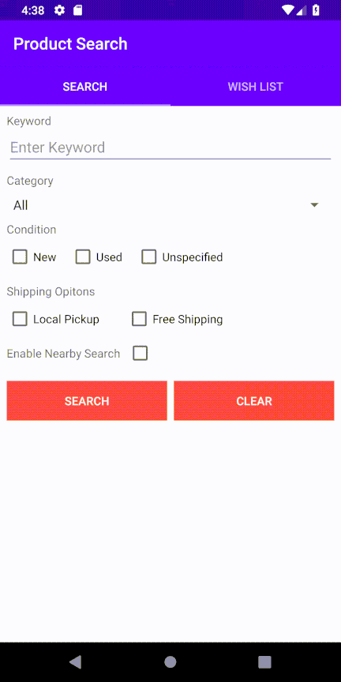
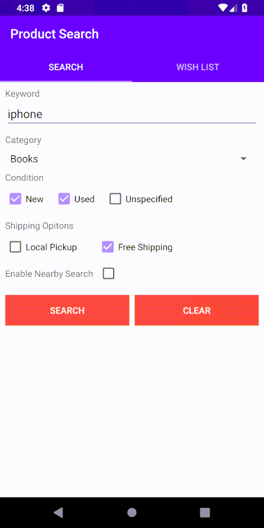
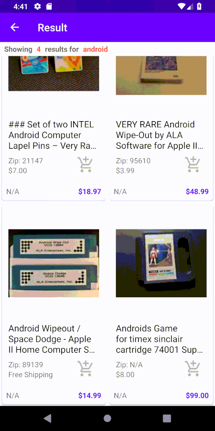

# Eaby Product Search
PHP integrated web page, Angular7 based web application, and Android (adk28) Java application for Ebay product search.

__Lineng Cao__

## [PHP Verison](http://vince-amazing-php.us-west-1.elasticbeanstalk.com/)
- PHP7 combined with Html5
- All API called from PHP server side

## [Angular Verison](http://vince-amazing.us-west-1.elasticbeanstalk.com/search-product/)
- Entire Angular7 with Bootstrap powered FrontEnd website, Using reactive form and angular materials principles.(`@angular/ng-bootstrap`, `@angular/material`, `angular-svg-round-progressbar`).
- Nodejs & Express based BackEnd serving on AWS EC2 and Azure.
- Special Restful APIs were created for supporting all requests from the frontend filled with error handling.
- Featured with autocomplete, ip detected, group sorting and offline cart list.

## BackEnd Restful APIs
- [Zipcode IP Autocomplete](http://aws.vince-amazing.com/api/ip-json/?startsWith=900)
- [Google Image Search](http://aws.vince-amazing.com/api/google-img?v=1&productTitle=iphone)
- [eBay Product Search](http://aws.vince-amazing.com/api/search/?keyword=iphone&buyerPostalCode=90007&MaxDistance=100&FreeShippingOnly=true&LocalPickupOnly=true)
- [eBay Project Detail Search](http://aws.vince-amazing.com/api/item-detail/?itemId=283622107255)
- [eBay Similar Search](http://aws.vince-amazing.com/api/similar/?itemId=283622107255)

### Screenshots
__Detail__

__Search__

__Wish List Feature__

## [Android Verison](https://github.com/vincecao/Eaby-Product-Search/raw/master/AndroidVer/apk/product-search-debug-v1.apk)
- Nodejs & Express based BackEnd serving on aws and Azure.
- Using recyclerview, fragment and data module.
- Featured with autocomplete, ip detected, simliar group sorting, cache offline wish list

### Screenshots
__Launch__

__Detail__

__Search__

__Wish List Feature__

### Download Demo
[Apk Download](https://github.com/vincecao/Eaby-Product-Search/raw/master/AndroidVer/apk/product-search-debug-v1.apk)

